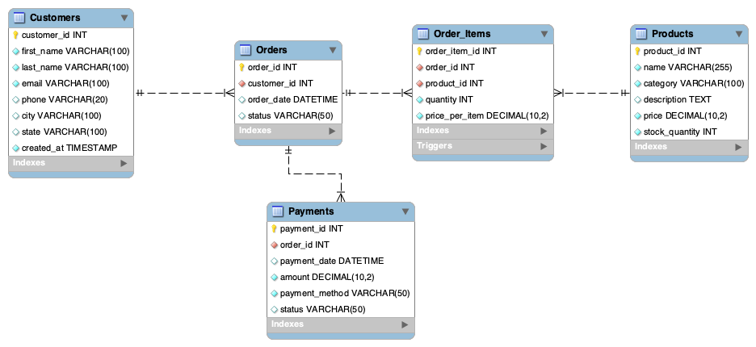

# E-Commerce Order and Inventory Database System 🛒

## Project Overview

This project is a MySQL-based relational database system designed for an e-commerce business. It manages customers, products, orders, order items, payments, and inventory updates.

The main goal of this project is to demonstrate database design, normalization, SQL reporting, stored procedures, views, and triggers using a realistic online retail workflow.

---

## Key Features

- Designed a normalized relational database with proper primary keys and foreign keys.
- Created tables for customers, products, orders, order items, and payments.
- Inserted realistic sample data for customers, products, orders, and payments.
- Developed SQL reports for sales, customers, products, payments, and inventory analysis.
- Created views for reusable sales and order summary reports.
- Implemented stored procedures for customer order history and monthly sales reports.
- Added triggers to validate stock availability and automatically update inventory after an order item is inserted.

---

## Database Tables

The database contains the following tables:

- `Customers`
- `Products`
- `Orders`
- `Order_Items`
- `Payments`

---

## SQL Concepts Used

- DDL and DML
- Primary Keys and Foreign Keys
- Constraints
- Joins
- Aggregate Functions
- GROUP BY and ORDER BY
- Views
- Stored Procedures
- Triggers
- Indexes
- Business Reporting Queries

---

## Business Reports Generated

The `Reports.sql` file includes queries for:

- Total revenue
- Monthly sales trend
- Top customers by revenue
- Best-selling products
- Category-wise revenue
- Low-stock products
- Payment method revenue
- Average order value
- Repeat customers
- Order status summary

---

## EER Diagram



---

## Files in this Repository

- `schema.sql` - Creates the database, tables, constraints, indexes, and triggers.
- `data.sql` - Inserts sample data into the database.
- `Reports.sql` - Contains business analysis queries, views, and stored procedures.
- `EER_Diagram.png` - Visual representation of the database schema.
- `README.md` - Project documentation.

---

## How to Run

Run the files in the following order:

```sql
source schema.sql;
source data.sql;
source Reports.sql;
